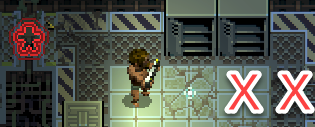

# Quasimorph Force Continue on Monster Detected

## Description
This mod allows the user to hold down the ctrl key to keep moving even if new enemies are detected. Detected enemies have a red asterisk. 

For instance, while walking down a long hallway, the merc will stop every time a new enemy is detected.  This can stop the movement of the merc many times when there are long hallways with many enemies in adjacent rooms.

## How the Game Works
The game will stop the merc anytime an enemy comes into detected range.  If the enemy stays detected, the merc will not stop.  However, if that enemy goes out of range and is detected again, the merc will be stopped again.

# Support
If you enjoy my mods and want to buy me a coffee, check out my [Ko-Fi](https://ko-fi.com/nbkredspy71915) page.
Thanks!

# Source Code
Source code is available on GitHub at https://github.com/NBKRedSpy/QM_StopOnDetected

# Change Log
## 2.1.0 
* Game Bug Workaround:  Workaround for game issue where allies also stop movement.  Thanks to Steam user endersteve_mine for reporting this issue.

## 2.0.1
* Fix:  Was black locking the game when a new level was generated.  Thank you to Discord user Crd for reporting this.

## 2.0.0
* Compatibility with 0.9.1.  Removed the duplicate "stop on detection" that the base game now does.

## 1.1.1
* Fixes issue where player could not change movement speed if the mod stopped the player.  Thanks goes to the🅱adman on the Quasimorph Official Discord for reporting this.
## 1.1.0
* v0.8.5 compatible.