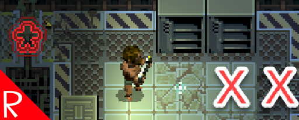

# Quasimorph Stop on Monster Detected

# Imporant!
This is for the opt in 0.9.1 beta and does not work for the current release.  Use the version of the mod without the beta suffix.

# Docs
As of 0.9.1 beta, the player will now stop movement any time a visible or detected enemy is detected.  The detected units are represented by the red * on a tile.

This mod allows the user to hold down the control key and continue walking if there are only detected units.  This does not affect seen units.

This is helpful when the player needs to walk down a long hallway and there are detected units that will not be in a position to attack the player.  

# Support
If you enjoy my mods and want to buy me a coffee, check out my [Ko-Fi](https://ko-fi.com/nbkredspy71915) page.
Thanks!

# Source Code
Source code is available on GitHub at https://github.com/NBKRedSpy/QM_StopOnDetected

# Change Log
## 2.0
* Compatibility with 0.9.1.  Removed the duplicate "stop on detection" that the base game now does.

## 1.1.1
* Fixes issue where player could not change movement speed if the mod stopped the player.  Thanks goes to the🅱adman on the Quasimorph Official Discord for reporting this.
## 1.1.0
* v0.8.5 compatible.